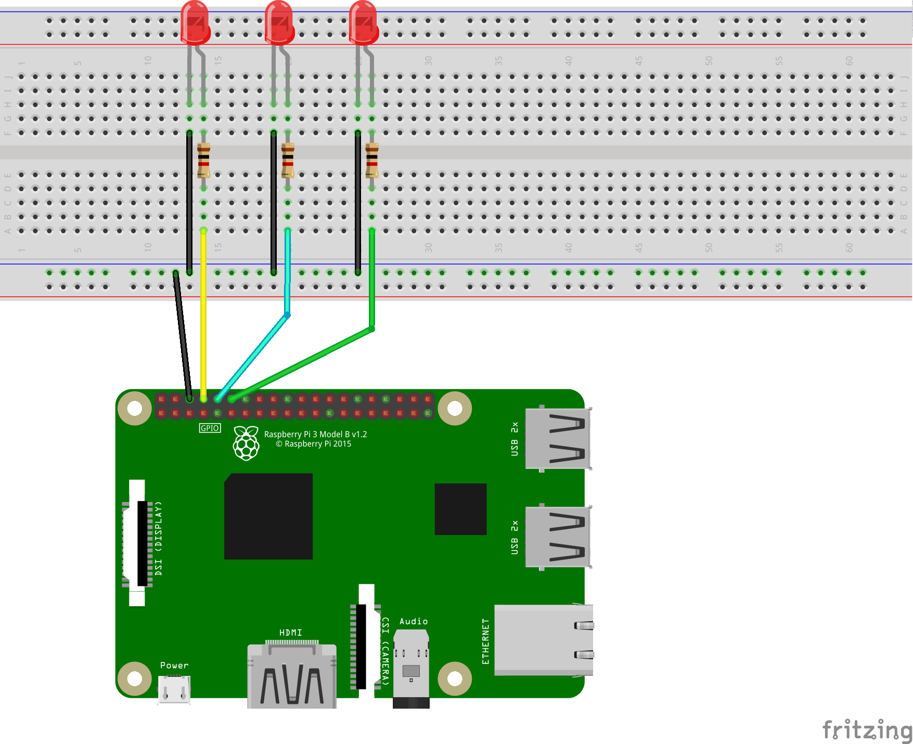

Experimentos básicos com a GPIO do Raspberry pi.
================================================


Experimento 1.
==============
### Led blink
### Monte o seguinte circuito:

### Código:
```python
# modulos necessarios
import RPi.GPIO as GPIO
import time
import signal
import sys

# para poder usar os pinos
GPIO.setmode(GPIO.BCM)

# pino a ser usado
led = 14

# limpar a GPIO, caso preciso
def limpa(signal, frame):
    GPIO.cleanup()
    sys.exit(0)

signal.signal(signal.SIGINT, limpa)

# define pino como saida
GPIO.setup(led, GPIO.OUT)

while True:

    GPIO.output(led, True)
    print("Ligado")
    time.sleep(1)
    GPIO.output(led, False)
    print("Desligado")
    time.sleep(1)
```
[Link do código do experimento 1](experimento1/ledblink.py)


Experimento 2.
==============
### Led fade
### Monte o seguinte circuito:

### Código:
```python
# modulos necessarios
import RPi.GPIO as GPIO
import time
import signal
import sys

# para poder usar os pinos
GPIO.setmode(GPIO.BCM)

# pino a ser usado
led = 14

# limpar a GPIO, caso preciso
def limpa(signal, frame):
    GPIO.cleanup()
    sys.exit(0)

signal.signal(signal.SIGINT, limpa)

# define pino como saida
GPIO.setup(led, GPIO.OUT)

# define e comeca a PWM (pulse-width modulation)
pwm = GPIO.PWM(led, 1000)
pwm.start(0)

# vars de controle
brilho = 0
fade = 1

while True:
   
    brilho += fade

    pwm.ChangeDutyCycle(brilho)

    if brilho == 0 or brilho == 100:
        fade = -fade

    time.sleep(0.02)
```
[Link do código do experimento 2](experimento2/ledfade.py)


Experimento 3.
==============
### Ligar led pelo terminal
### Monte o seguinte circuito:

### Código:
```python
# modulos necessarios
import RPi.GPIO as GPIO
import time
import signal
import sys

# num dos leds (referentes a GPIO)
led1 = 14
led2 = 15
led3 = 18

# para poder usar os pinos
GPIO.setmode(GPIO.BCM)

# limpar a GPIO, caso preciso
def limpa(signal, frame):
    GPIO.cleanup()
    sys.exit(0)

signal.signal(signal.SIGINT, limpa)

# define pinos como saida
GPIO.setup(led1, GPIO.OUT)
GPIO.setup(led2, GPIO.OUT)
GPIO.setup(led3, GPIO.OUT)

while True:

    print("Digite o numero do led que deseja ligar/desligar:")
    led = input()

    print("Digite o estado: (1 = ligar, 0 = desligar)")
    state = input()
    
    if True:
        if led == 1:
            if state == 1:
                state = True
                led = led1 

            elif state == 0:
                state = False
                led = led1

            else:
                pass

        elif led == 2:
            if state == 1:
                state = True
                led = led2

            elif state == 0:
                state = False
                led = led2

            else:
                pass
            
        elif led == 3:
            if state == 1:
                state = True
                led = led3

            elif state == 0:
                state = False
                led = led3

            else:
                pass
         
    else:
        pass

    GPIO.output(led, state)

```
[Link do código do experimento 3](experimento3/ledterminal.py)


Experimento 4.
==============
### Ler estado do botão
### Monte o seguinte circuito:

### Código:
```python
# modulos necessarios
import RPi.GPIO as GPIO
import time
import signal
import sys

# para poder usar os pinos
GPIO.setmode(GPIO.BCM)

# pino a ser usado
button = 14

# limpar a GPIO, caso preciso
def limpa(signal, frame):
    GPIO.cleanup()
    sys.exit(0)

signal.signal(signal.SIGINT, limpa)

# define pino como saida
GPIO.setup(button, GPIO.IN)

while True:

    if GPIO.input(button) == True:
        print("Botao pressionado")

    else:
        print("Botao despressionado")

    time.sleep(0.08)
```
[Link do código do experimento 4](experimento4/button.py)


Experimento 5.
==============
### Operações lógicas
### Monte o seguinte circuito:

### Código:
```python
# modulos necessarios
import RPi.GPIO as GPIO
import time
import signal
import sys

# para poder usar os pinos
GPIO.setmode(GPIO.BCM)

# pinos a serem usados
led1 = 14 # xor
led2 = 15 # or
led3 = 18 # and

bot1 = 23
bot2 = 24

# vars logicas
a = False
b = False
c = False

# limpar a GPIO, caso preciso
def limpa(signal, frame):
    GPIO.cleanup()
    sys.exit(0)

signal.signal(signal.SIGINT, limpa)

# define pino como saida
GPIO.setup(bot1, GPIO.IN)
GPIO.setup(bot2, GPIO.IN)

GPIO.setup(led1, GPIO.OUT)
GPIO.setup(led2, GPIO.OUT)
GPIO.setup(led3, GPIO.OUT)

while True:

    a = GPIO.input(bot1)
    b = GPIO.input(bot2)

    print("----------------------------------\nValores: ")
    print(a, b) 
    
    print("----------\nxor: ")
    c = a ^ b
    print(c)
    GPIO.output(led1, c)

    print("----------\nor: ")
    c = a or b
    print(c)
    GPIO.output(led2, c)

    print("----------\nand: ")
    c = a and b
    print(c)
    GPIO.output(led3, c)

    time.sleep(0.12)

```
[Link do código do experimento 5](experimento5/logic.py)
